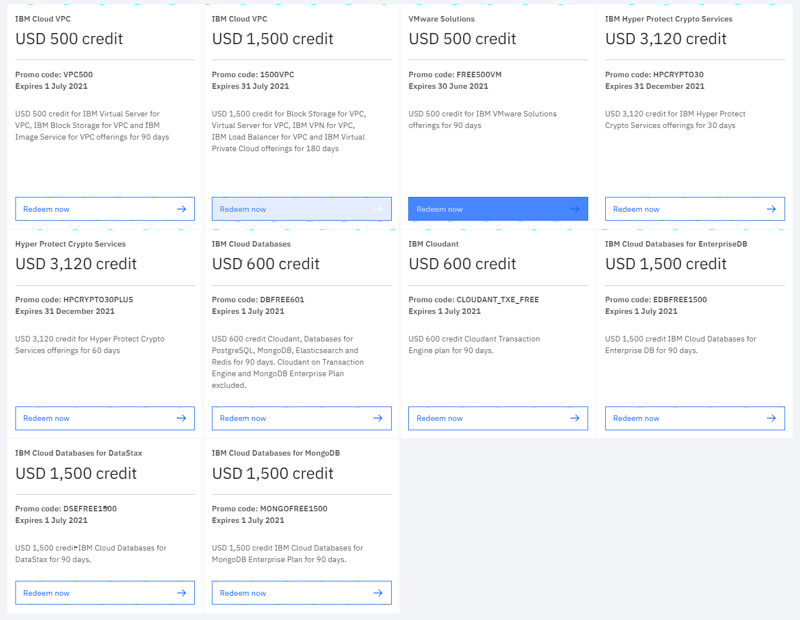

## Object storage
- IBM Cloud Object Storage
    - 25 GB per month
- IBM Cloud SQL Query
    - Scan up to 30 GB/day
## Database
- IBM Cloudant
    - 1 GB of data storage
- IBM Db2 on Cloud
    - 100 MB of data storage
- IBM Cloud Hyper Protect DBaaS for MongoDB
    - 2 GB of data storage    
## Cloud Native
- IBM Cloud Functions
    - 5 million operations per month
- IBM services for Cloud Foundry
    - 256 MB
- IBM Cloud Container Registry
    - 5 GB per month pull data transfer
## AI
- IBM Watson
    - Watson Discovery
        - 1,000 documents per month
    - Watson Text to Speech
        - 10,000 characters per month
    - Watson Assistant
        - 10,000 API calls per month
    - Watson Knowledge Catalog
        - 1 catalog
    - Watson Language Translator
        - 1,000,000 characters per month
    - Watson Natural Language Understanding
        - 1 custom model
    - Watson Visual Recognition
        - 2 custom models
    - Watson Tone Analyzer
        - 2,500 API calls per month
    - Watson Personality Insights
        - 1,000 API calls per month
## Big Data
- IBM Cloud Analytics Engine
    - 50 node hours
## Event, Notification, Audit
- IBM Cloud Activity Tracker
    - 100,000 most recent cloud activity events    
- IBM Cloud App ID
    - 1,000 monthly events
- IBM Push Notifications
    - 100,000 digital messages per month
## IBM Promotion

## Other
- IBM API Connect®
    - 50,000 API calls per month
- IBM Cloud Continuous Delivery
    - 500 delivery pipeline jobs
- IBM Cloud Availability Monitoring
    - 3 million data points per month
- IBM Cloud Schematics
- IBM Cloud Hyper Protect Virtual Server
    - 1 vCPU
- IBM Streams
    - 1 dedicated application resource
- IBM Cloud Certificate Manager
    - 1,000 certificates per instance
- IBM Secure Gateway Service
    - 500 MB in monthly data transfer
- IBM Cloud Key Protect
    - 20 keys
